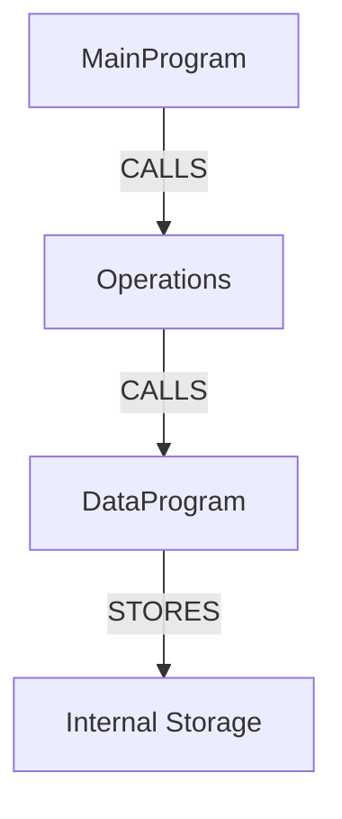

# COBOL Program Dependency Map

## Overview
This document shows the dependency relationships between the COBOL programs in the Account Management System.

## Program Dependencies



## Detailed Dependency Analysis

### MainProgram.cob
- **Role**: Main menu interface
- **Dependencies**: 
  - CALLS 'Operations' program with different operation types:
    - 'TOTAL ' - View balance
    - 'CREDIT' - Credit account
    - 'DEBIT ' - Debit account
- **Called by**: None (entry point)

### Operations.cob
- **Role**: Business logic layer
- **Dependencies**:
  - CALLS 'DataProgram' with different operations:
    - 'READ' - Read current balance
    - 'WRITE' - Write updated balance
- **Called by**: MainProgram
- **Operation types handled**:
  - 'TOTAL ' - Displays current balance
  - 'CREDIT' - Adds amount to balance
  - 'DEBIT ' - Subtracts amount from balance (with validation)

### DataProgram.cob
- **Role**: Data access layer
- **Dependencies**: None (uses internal WORKING-STORAGE)
- **Called by**: Operations
- **Operations supported**:
  - 'READ' - Returns STORAGE-BALANCE to caller
  - 'WRITE' - Updates STORAGE-BALANCE from caller

## Data Flow

```
MainProgram (User Interface)
    ↓ (User choice: 1, 2, or 3)
Operations (Business Logic)
    ↓ (Operation type + amount if applicable)
DataProgram (Data Access)
    ↓ (Read/Write operations)
Internal Storage (STORAGE-BALANCE)
```

## Modernization Notes

1. **MainProgram** → `MainProgram` class (main_program.py)
   - Replaced COBOL menu loop with Python while loop
   - Used class-based approach for better organization

2. **Operations** → `Operations` class (operations.py)
   - Separated business logic from UI
   - Added proper error handling for invalid inputs
   - Used dependency injection for data service

3. **DataProgram** → `DataProgram` class (data_program.py)
   - Simple data access layer
   - Can be extended to use database instead of in-memory storage

## Modernization Architecture

```
User Interface Layer (MainProgram)
    ↓
Business Logic Layer (Operations)
    ↓
Data Access Layer (DataProgram)
    ↓
Database Layer (PostgreSQL)
```

The modernization maintains the same logical flow but uses modern Python practices:
- Object-oriented design
- Separation of concerns
- Dependency injection
- Proper error handling
- Unit testability